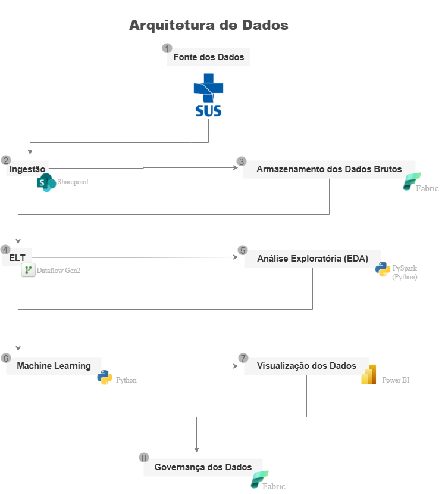
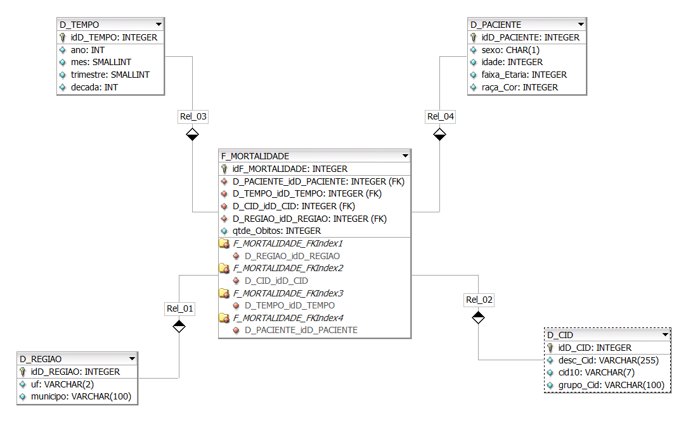
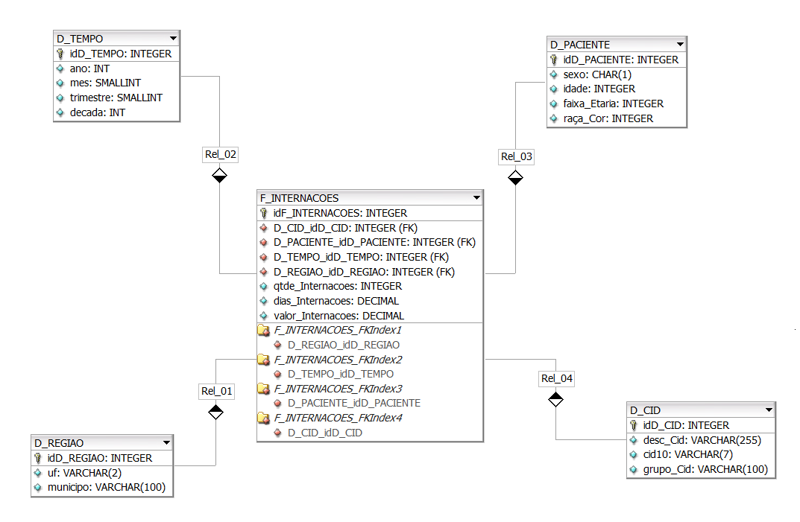
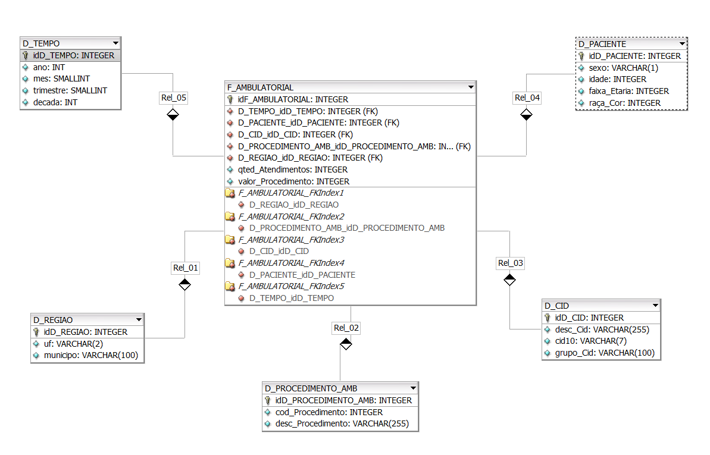
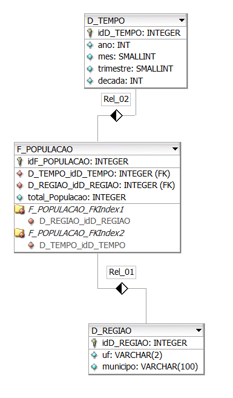

## **Introdução**

O presente documento descreve o processo de implementação da arquitetura de dados proposta para o projeto de Ciência de Dados do 5º semestre do curso de Tecnologia em Banco de Dados, ministrado pela PUC Minas. O objetivo é detalhar, de forma técnica, cada etapa envolvida, a fim de garantir clareza no fluxo de informações desde a sua origem até a disponibilização de insights analíticos. A arquitetura foi concebida para assegurar escalabilidade, governança e confiabilidade dos resultados.

## **Fontes de Dados**

As fontes de dados constituem o ponto de partida do projeto. Os dados serão extraídos do site do do SUS. Essas fontes consistem em diversos arquivos externos no formato .dbc, que deverão ser descompactados e, posteriormente, convertidos em CSV. Elas fornecem dados estruturados e não estruturados, os quais serão integrados ao pipeline.

## **Ingestão e Armazenamento de Dados**

Os dados coletados são inicialmente armazenados em sua forma bruta em um repositório centralizado e escalável no Microsoft Fabric.
A etapa de ELT (Extract, Load, Transform), realizada por meio da linguagem Python, consistirá na coleta, carregamento e padronização dos dados. Nessa fase, são aplicadas transformações para corrigir inconsistências, remover duplicidades e uniformizar formatos. O resultado é um conjunto de dados tratado e preparado para armazenamento.

  

## **Modelagem de Dados**

A partir das bases de dados levantadas, foram identificadas quatro tabelas fato principais, cada uma acompanhada de suas respectivas dimensões. A seguir apresentamos os modelos:

### 1. Tabela Fato: F_MORTALIDADE

  

| Campo                      | Tipo    | Descrição                                                           |
| -------------------------- | ------- | ------------------------------------------------------------------- |
| idF\_MORTALIDADE           | INTEGER | Identificador único da ocorrência de mortalidade (chave surrogate). |
| D\_PACIENTE\_idD\_PACIENTE | INTEGER | Chave estrangeira que referencia o paciente (dimensão paciente).    |
| D\_TEMPO\_idD\_TEMPO       | INTEGER | Chave estrangeira que referencia a dimensão tempo.                  |
| D\_CID\_idD\_CID           | INTEGER | Chave estrangeira que referencia a dimensão CID (causa do óbito).   |
| D\_REGIAO\_idD\_REGIAO     | INTEGER | Chave estrangeira que referencia a região do óbito.                 |
| qtde\_Obitos               | INTEGER | Quantidade de óbitos registrados no período e contexto analisado.   |

### 2.Tabela Fato: F_INTERNACOES

  

| Campo                      | Tipo    | Descrição                                                                              |
| -------------------------- | ------- | -------------------------------------------------------------------------------------- |
| idF\_INTERNACOES           | INTEGER | Identificador único da ocorrência de internação (chave surrogate).                     |
| D\_CID\_idD\_CID           | INTEGER | Chave estrangeira que referencia a dimensão CID (diagnóstico principal da internação). |
| D\_PACIENTE\_idD\_PACIENTE | INTEGER | Chave estrangeira que referencia a dimensão paciente.                                  |
| D\_TEMPO\_idD\_TEMPO       | INTEGER | Chave estrangeira que referencia a dimensão tempo (data da internação).                |
| D\_REGIAO\_idD\_REGIAO     | INTEGER | Chave estrangeira que referencia a dimensão região (local da internação).              |
| qtde\_Internacoes          | INTEGER | Quantidade de internações registradas no período e contexto analisado.                 |
| dias\_Internacoes          | DECIMAL | Número total de dias de permanência hospitalar das internações.                        |
| valor\_Internacoes         | DECIMAL | Valor financeiro associado às internações no período.                                  |

### 3.Tabela Fato: F_AMBULATORIAL

  

| Campo                                        | Tipo    | Descrição                                                                                 |
| -------------------------------------------- | ------- | ----------------------------------------------------------------------------------------- |
| idF\_AMBULATORIAL                            | INTEGER | Identificador único da ocorrência ambulatorial (chave surrogate).                         |
| D\_TEMPO\_idD\_TEMPO                         | INTEGER | Chave estrangeira que referencia a dimensão tempo (data do atendimento).                  |
| D\_PACIENTE\_idD\_PACIENTE                   | INTEGER | Chave estrangeira que referencia a dimensão paciente.                                     |
| D\_CID\_idD\_CID                             | INTEGER | Chave estrangeira que referencia a dimensão CID (diagnóstico relacionado ao atendimento). |
| D\_PROCEDIMENTO\_AMB\_idD\_PROCEDIMENTO\_AMB | INTEGER | Chave estrangeira que referencia a dimensão procedimento ambulatorial.                    |
| D\_REGIAO\_idD\_REGIAO                       | INTEGER | Chave estrangeira que referencia a dimensão região (local do atendimento).                |
| qted\_Atendimentos                           | INTEGER | Quantidade de atendimentos ambulatoriais realizados no período.                           |
| valor\_Procedimento                          | DECIMAL | Valor associado ao procedimento ambulatorial.                                             |

### 4.Tabela Fato: F_POPULACAO

  

| Campo                  | Tipo    | Descrição                                                                        |
| ---------------------- | ------- | -------------------------------------------------------------------------------- |
| idF\_POPULACAO         | INTEGER | Identificador único do registro de população (chave surrogate).                  |
| D\_TEMPO\_idD\_TEMPO   | INTEGER | Chave estrangeira que referencia a dimensão tempo (ano, mês, trimestre, década). |
| D\_REGIAO\_idD\_REGIAO | INTEGER | Chave estrangeira que referencia a dimensão região (estado e município).         |
| total\_Populacao       | INTEGER | Total da população estimada ou projetada para o período e região correspondente. |

### 5.Tabela Dimensão: D_TEMPO

  | Campo      | Tipo     | Descrição                                     |
| ---------- | -------- | ----------------------------------------------- |
| idD\_TEMPO | INTEGER  | Identificador único do tempo (chave surrogate). |
| ano        | INT      | Ano do registro.                                |
| mes        | SMALLINT | Número do mês (1 a 12).                         |
| trimestre  | SMALLINT | Número do trimestre (1 a 4).                    |
| decada     | INT      | Década de referência (ex: 1990, 2000).          |

### 6.Tabela Dimensão: D_REGIAO

| Campo       | Tipo         | Descrição                                        |
| ----------- | ------------ | ------------------------------------------------ |
| idD\_REGIAO | INTEGER      | Identificador único da região (chave surrogate). |
| uf          | VARCHAR(2)   | Unidade federativa (sigla do estado).            |
| municipio   | VARCHAR(100) | Nome do município da ocorrência.                 |

### 7.Tabela Dimensão: D_PACIENTE

| Campo         | Tipo    | Descrição                                          |
| ------------- | ------- | -------------------------------------------------- |
| idD\_PACIENTE | INTEGER | Identificador único do paciente (chave surrogate). |
| sexo          | CHAR(1) | Sexo do paciente (M/F).                            |
| idade         | INTEGER | Idade do paciente.                                 |
| faixa\_Etaria | INTEGER | Código da faixa etária do paciente.                |
| raça\_Cor     | INTEGER | Código da raça/cor do paciente.                    |

### 8.Tabela Dimensão: D_CID

| Campo      | Tipo         | Descrição                                                |
| ---------- | ------------ | -------------------------------------------------------- |
| idD\_CID   | INTEGER      | Identificador único da causa do óbito (chave surrogate). |
| desc\_Cid  | VARCHAR(255) | Descrição da doença/causa segundo CID-10.                |
| cid10      | VARCHAR(7)   | Código CID-10 da doença/causa.                           |
| grupo\_Cid | VARCHAR(100) | Grupo ou categoria de doenças.                           |

### 9.Tabela Dimensão: D_PROCEDIMENTO_AMB
  
| Campo                  | Tipo         | Descrição                                                           |
| ---------------------- | ------------ | ------------------------------------------------------------------- |
| idD\_PROCEDIMENTO\_AMB | INTEGER      | Identificador único do procedimento ambulatorial (chave surrogate). |
| cod\_Procedimento      | INTEGER      | Código do procedimento ambulatorial (tabela SIGTAP ou similar).     |
| desc\_Procedimento     | VARCHAR(255) | Descrição detalhada do procedimento ambulatorial.                   |

## **Análise Exploratória de Dados (EDA)**

A análise exploratória tem como finalidade compreender o perfil dos dados. Serão aplicadas técnicas estatísticas e de visualização para identificar distribuições, correlações e padrões relevantes. Para essa etapa, será utilizada a linguagem de programação Python, com bibliotecas como pandas e matplotlib.

## **Desenvolvimento de Modelos de Machine Learning**

Nesta etapa, serão desenvolvidos modelos preditivos e/ou prescritivos baseados em algoritmos de aprendizado de máquina. O processo contempla a seleção de variáveis, a escolha de algoritmos adequados, o treinamento, a validação e a avaliação de desempenho dos modelos.

## **Visualização dos Dados**

A camada de visualização tem como propósito disponibilizar os resultados das análises e dos modelos em formatos intuitivos e interativos. Serão desenvolvidos dashboards e relatórios no Power BI, de modo a permitir que os stakeholders interpretem as informações de forma ágil e estratégica. Essa camada traduz a complexidade técnica em insights acionáveis para suporte à decisão.

## **Governança de Dados**

A governança de dados assegura conformidade, segurança e confiabilidade em todo o ciclo de vida da informação. Inclui práticas de catalogação, controle de acesso, auditoria, monitoramento e aplicação de políticas de qualidade. Contudo, por se tratar de dados abertos fornecidos pelo SUS, não há necessidade de aplicação de governança de dados, uma vez que já estão públicos e disponíveis para uso.

## **Considerações Finais**
A arquitetura de dados especificada neste documento representa uma abordagem robusta e estruturada para projetos de Ciência de Dados, podendo ser aplicada de forma geral. Ao seguir as etapas descritas, obtém-se uma visão integrada do ciclo de vida da informação, permitindo exploração, modelagem e geração de insights com base em dados consistentes e governados. O cumprimento disciplinado de cada fase garante maior maturidade analítica e suporte efetivo à tomada de decisão.

