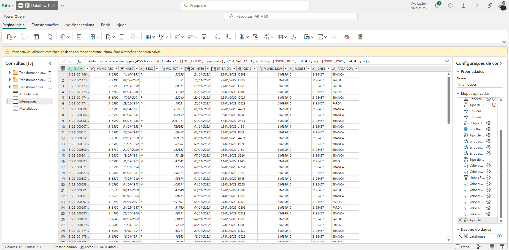
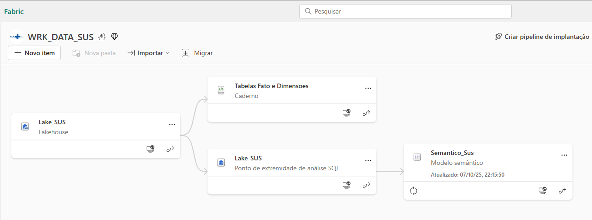
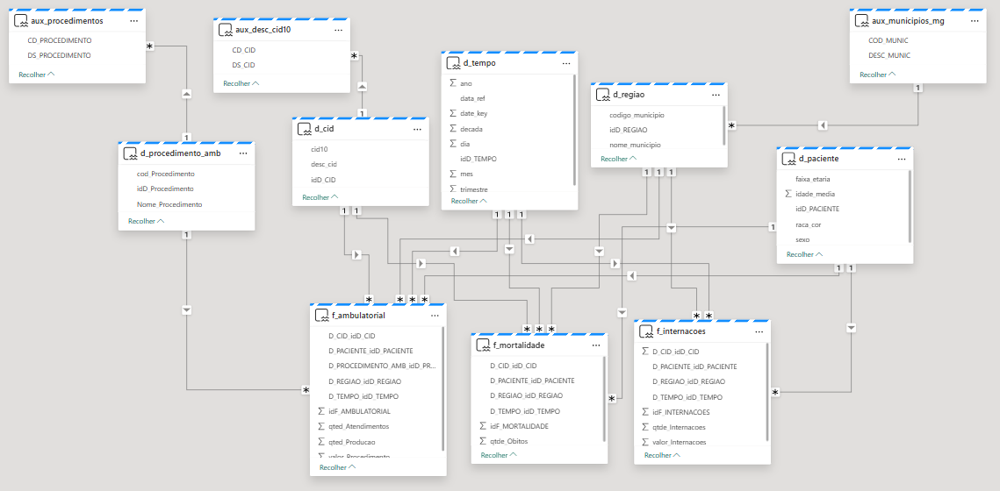

## **Pré-Processamento de Dados**

Na terceira fase do projeto, os dados já foram reunidos e encontram-se disponíveis, provenientes de diversas fontes e em múltiplos formatos. Nesta etapa, o foco principal é realizar o pré-processamento, assegurando que as informações estejam organizadas, padronizadas e adequadas para as próximas análises e para o treinamento de modelos de machine learning. Essa etapa é essencial para garantir a qualidade e a uniformidade dos dados, influenciando diretamente a precisão e a confiabilidade dos resultados obtidos.

### **Análise Exploratória**

**Camada Bronze**

Para a análise dos dados, optamos por utilizar o modelo de arquitetura em medalhão, que organiza as informações em camadas progressivas de qualidade e refinamento. Durante essa etapa, identificamos que os arquivos no formato .csv estavam segmentados por mês. Assim, na camada bronze, centralizamos e armazenamos esses conjuntos de dados brutos em três repositórios do **SharePoint** no Fabric, garantindo uma melhor estruturação e facilidade de gerenciamento das informações. 

  

**Camada Silver**

Para o tratamento inicial dos dados, optamos por utilizar a ferramenta **Dataflow Gen2**, disponível no Fabric, com o objetivo de simplificar e agilizar o processo de transformação por meio do **Power Query**. Durante essa etapa, enfrentamos alguns desafios, já que trabalhamos com três bases de dados distintas, o que exigiu a padronização dos formatos dos campos existentes.

Padronizamos a coluna Sexo para os valores “F” e “M”, e realizamos um mapeamento *DE/PARA* na coluna *Raça Cor* , alinhando-a ao padrão estabelecido pelo *Instituto Brasileiro de Geografia e Estatística (IBGE)*. As colunas de Data foram convertidas para o tipo **DATE**, no formato *dd/MM/yyyy*, enquanto os demais campos foram ajustados para seus tipos de dados adequados.

Após a padronização, passamos para a etapa de limpeza, removendo colunas que não seriam utilizadas nas análises e excluindo linhas com valores nulos, garantindo assim uma base mais consistente e confiável para a próxima etapa. 

  

**Camada Ouro**

Finalizadas as etapas de limpeza e tratamento inicial dos dados, realizamos a carga das tabelas em um Lakehouse denominado Lake_SUS. A partir desse ponto, deu-se início à criação das tabelas dimensão e tabelas fato. Graças à padronização prévia das bases, foi possível que as três tabelas fato compartilhassem as mesmas dimensões, garantindo maior integração e consistência no modelo. Para isso, utilizamos a ferramenta de Notebook disponível no Fabric, desenvolvendo os códigos em Python com o uso da biblioteca PySpark, responsável por estabelecer os relacionamentos entre as tabelas.

Com base na modelagem definida na etapa anterior, criamos as dimensões com suas respectivas chaves primárias. O principal desafio dessa fase concentrou-se na dimensão paciente, pois as bases originais não possuíam um identificador único para cada indivíduo. Diante disso, optamos por construir essa dimensão a partir de atributos característicos — como sexo, faixa etária e raça/cor —, criando assim um identificador único com base nessas combinações e separando os pacientes por faixa etária.

Durante o desenvolvimento das dimensões, identificamos a necessidade de criar tabelas auxiliares para complementar determinadas informações. Assim:

Para a dimensão d_cid, foi carregada a tabela aux_desc_cid, contendo a descrição dos códigos CID conforme o padrão do DATASUS.

Na dimensão d_região, utilizamos a tabela aux_municipios_mg, que reúne a descrição dos municípios de Minas Gerais, com base em dados do IBGE.

Já para a dimensão d_procedimento_amb, foi necessário incorporar a tabela aux_procedimentos, contendo a descrição dos procedimentos disponíveis na base SIGTAP.

Essas tabelas auxiliares permitiram enriquecer o modelo, agregando descrições e contextos que facilitaram as análises e interpretações. Na dimensão d_tempo, optamos por desmembrar o campo de data em ano, mês, trimestre, década e dia, de modo a simplificar o uso dessas informações em futuras aplicações de machine learning.

Concluímos, assim, a camada ouro, composta por três tabelas fato interligadas às suas respectivas dimensões, estruturadas e preparadas para a etapa de modelagem e aplicação dos algoritmos de aprendizado de máquina. 

  

  

### **Conclusão**

Optamos por aproveitar ao máximo as ferramentas disponíveis no Fabric, com o objetivo de tornar o processo de tratamento dos dados mais ágil e eficiente. Para a criação das tabelas fato e dimensão, o uso do PySpark permitiu modelar os dados de forma simples, estruturada e objetiva.

Com isso, concluímos a etapa de pré-processamento, resultando em uma base de dados consistente e de alta qualidade, pronta para ser utilizada nas etapas de aprendizado de máquina e análises avançadas.

## **Referências**

BRASIL. Ministério da Saúde. Sigtap — Sistema de Gerenciamento da Tabela de Procedimentos, Medicamentos e OPM do SUS. Disponível em: https://sigtap.datasus.gov.br/
. Acesso em: 10 out. 2025.

IBGE. Códigos dos Municípios. Disponível em: https://www.ibge.gov.br/explica/codigos-dos-municipios.php
. Acesso em: 10 out. 2025.

BRASIL. Ministério da Saúde. CID-10 – Classificação Estatística Internacional de Doenças e Problemas Relacionados à Saúde (versão 2008). Disponível em: https://www2.datasus.gov.br/cid10/V2008/download.htm
. Acesso em: 10 out. 2025.

Microsoft. Entender a arquitetura de lakehouse medallion para Microsoft Fabric com OneLake. Disponível em: https://learn.microsoft.com/pt-br/fabric/onelake/onelake-medallion-lakehouse-architecture
. Acesso em: 10 out. 2025.

